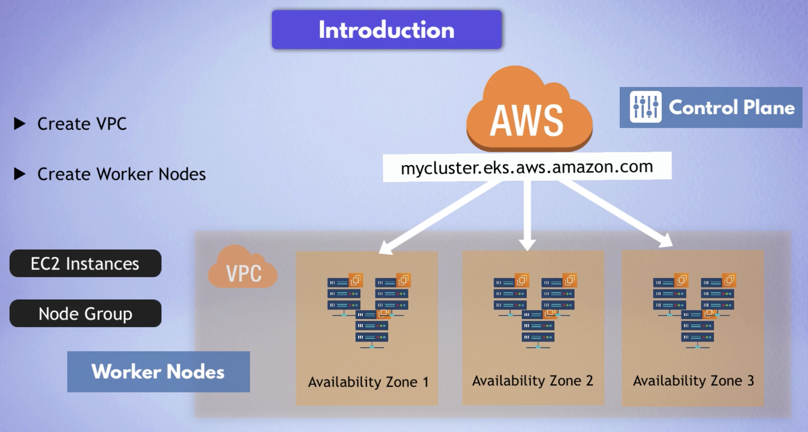
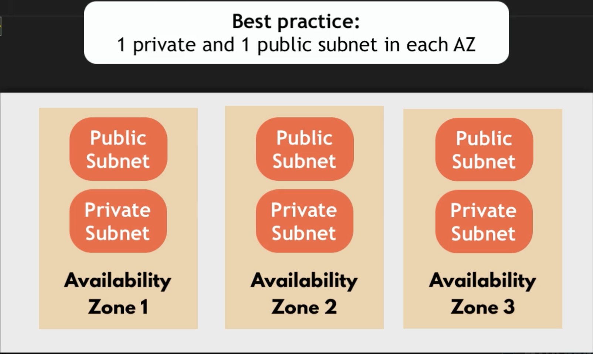
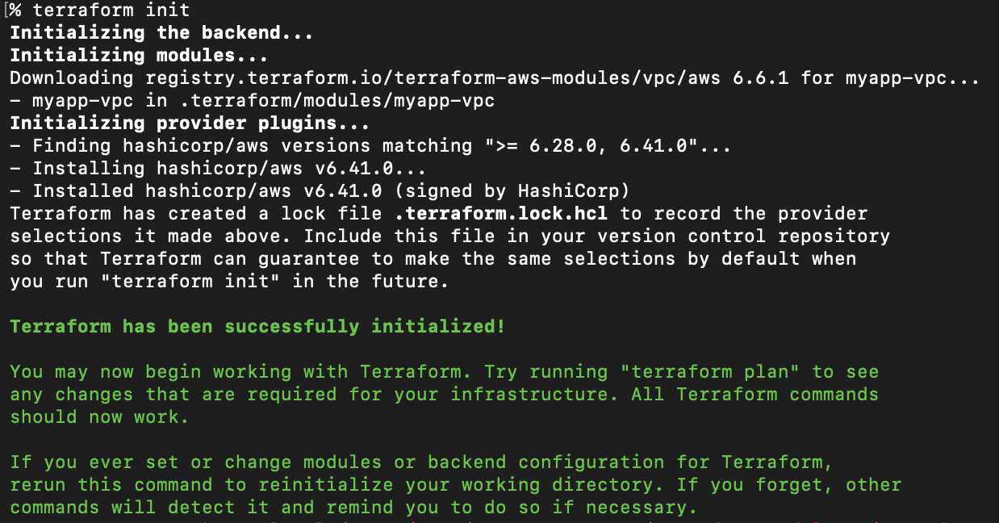
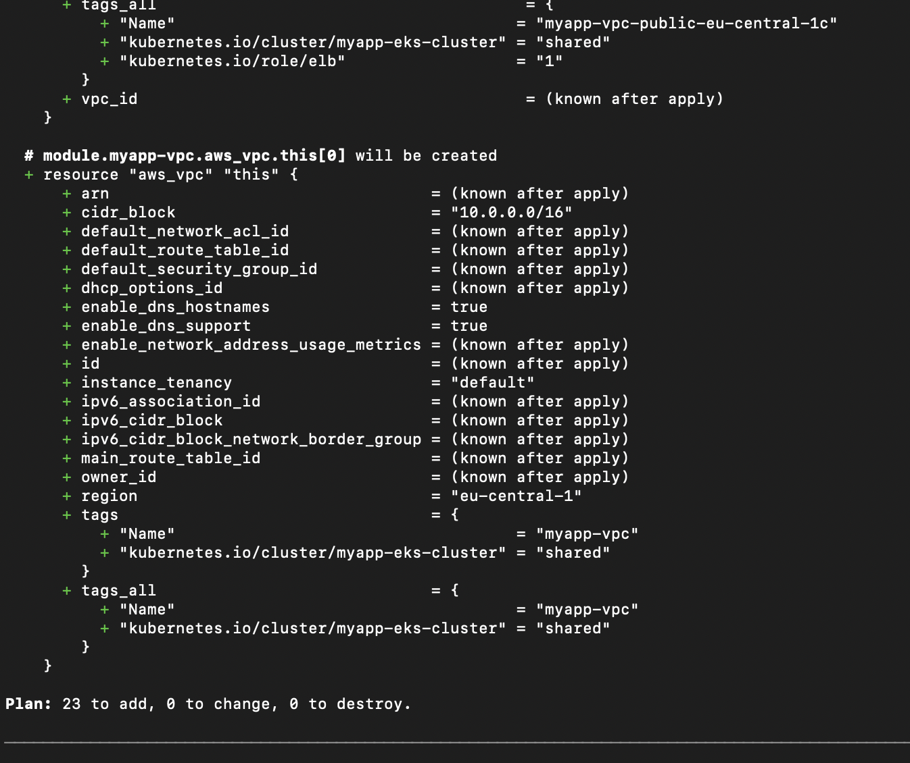
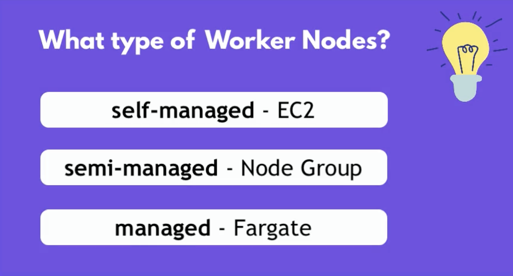
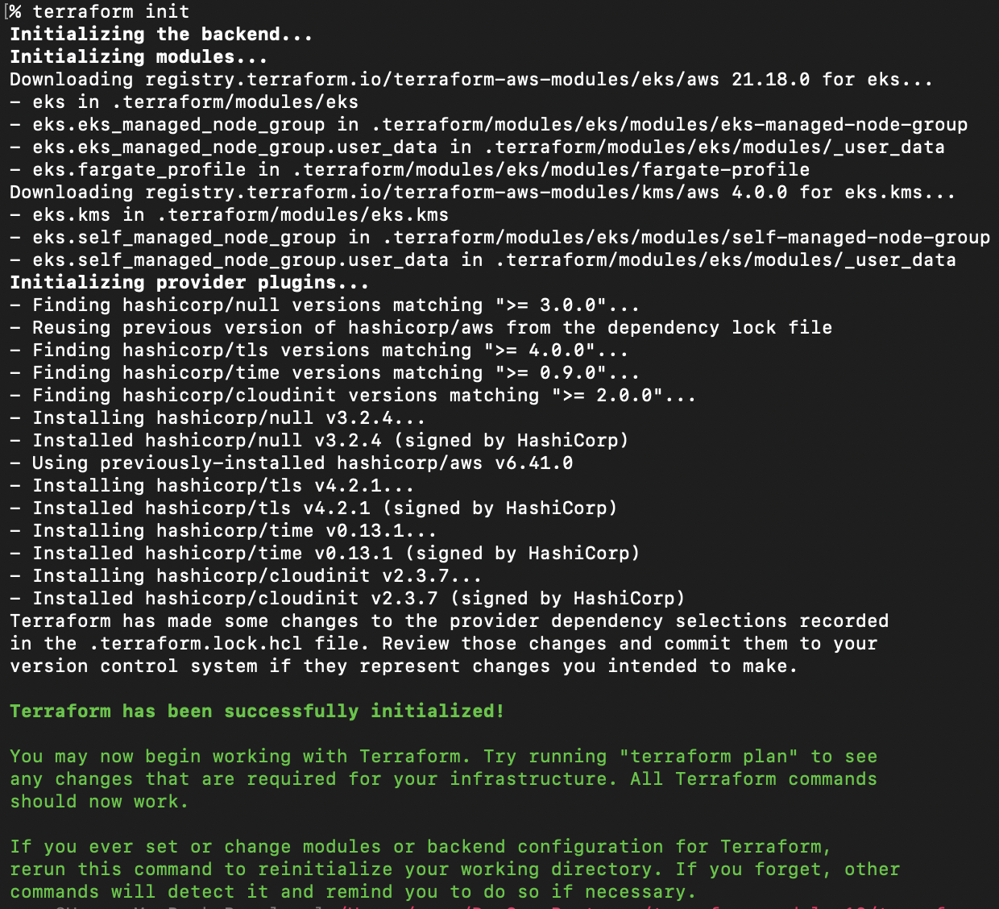
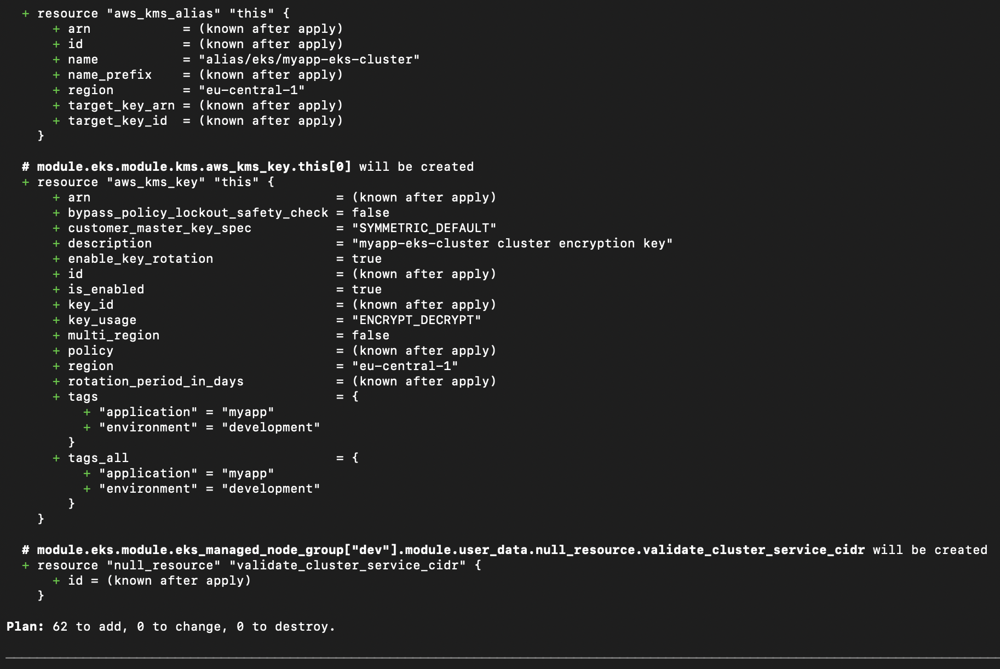

# Module 12 - Infrastructure as Code with Terraform

This repository contains a demo project created as part of my **DevOps studies** in the [TechWorld with Nana – DevOps Bootcamp](https://www.techworld-with-nana.com/devops-bootcamp).

**Demo Project:** Terraform & AWS EKS

**Technologies used:** Terraform, AWS EKS, Docker, Linux, Git

**Project Description:**

- Automate provisioning EKS cluster with Terraform

---

Introduction




### VPC

See VPC module: https://registry.terraform.io/modules/terraform-aws-modules/vpc/aws/latest

Best practice: 1 private and 1 public subnet in each AZ



See: [](./vpc.tf)


```sh
terraform init
```




```sh
terraform plan
```



### EKS Cluster & Worker Nodes

See EKS module: https://registry.terraform.io/modules/terraform-aws-modules/eks/aws/latest


Worker Nodes types



See: [](./eks-cluster.tf)

```sh
terraform init
```



```sh
terraform plan
```



```sh
terraform apply --auto-approve
```
