# Module 12 - Infrastructure as Code with Terraform

This repository contains a demo project created as part of my **DevOps studies** in the [TechWorld with Nana – DevOps Bootcamp](https://www.techworld-with-nana.com/devops-bootcamp).

**Demo Project:** Terraform & AWS EKS

**Technologies used:** Terraform, AWS EKS, Docker, Linux, Git

**Project Description:**

- Automate provisioning EKS cluster with Terraform

---

## Architecture Overview


The project provisions a production-style AWS infrastructure:
- A **VPC** with public and private subnets spread across multiple Availability Zones
- An **EKS cluster** with managed worker nodes running in private subnets
- A **NAT Gateway** so private nodes can reach the internet without being publicly exposed
- An **nginx application** deployed into the cluster, exposed via an AWS Load Balancer

---

## Project Structure

| File | Purpose |
|------|---------|
| [vpc.tf](./vpc.tf) | VPC, subnets, NAT gateway, and subnet tagging for EKS |
| [eks-cluster.tf](./eks-cluster.tf) | EKS control plane, addons, and managed node groups |
| [terraform.tfvars](./terraform.tfvars) | Variable values (region, CIDRs) — not committed |
| [terraform.tfvars.example](./terraform.tfvars.example) | Template for the vars file |
| [nginx.yaml](./nginx.yaml) | Kubernetes Deployment + LoadBalancer Service for nginx |

---

## Prerequisites

Copy and fill in the variables file:

```sh
cp terraform.tfvars.example terraform.tfvars
```

Edit `terraform.tfvars` to set your AWS region and desired CIDR blocks.

---

## VPC — [vpc.tf](./vpc.tf)

See VPC module: https://registry.terraform.io/modules/terraform-aws-modules/vpc/aws/latest

**Best practice:** 1 private + 1 public subnet per Availability Zone for high availability.


### Key configuration explained

```hcl
data "aws_availability_zones" "azs" {}
```
Dynamically fetches the list of AZs in the configured region — no hardcoding required.

```hcl
azs             = data.aws_availability_zones.azs.names
private_subnets = var.private_subnet_cidr_blocks
public_subnets  = var.public_subnet_cidr_blocks
```
Creates one private and one public subnet in each AZ using CIDRs from your vars file.

```hcl
enable_nat_gateway = true
single_nat_gateway = true
```
Places a single NAT Gateway in the public subnet. Worker nodes in private subnets route outbound traffic through it (e.g., to pull container images). `single_nat_gateway = true` keeps costs low for non-production; set to `false` for one NAT per AZ in production.

```hcl
enable_dns_hostnames = true
```
Required for EKS — nodes need DNS resolution to communicate with the control plane endpoint.

```hcl
tags = {
  "kubernetes.io/cluster/myapp-eks-cluster" = "shared"
}
```
Applied to the VPC itself. EKS uses this tag to discover which VPC belongs to the cluster.

```hcl
public_subnet_tags = {
  "kubernetes.io/cluster/myapp-eks-cluster" = "shared"
  "kubernetes.io/role/elb"                  = 1
}
```
`kubernetes.io/role/elb = 1` tells the AWS Load Balancer Controller to provision **internet-facing** load balancers in these subnets.

```hcl
private_subnet_tags = {
  "kubernetes.io/cluster/myapp-eks-cluster" = "shared"
  "kubernetes.io/role/internal-elb"         = 1
}
```
`kubernetes.io/role/internal-elb = 1` tags private subnets for **internal** load balancers. Worker nodes run here — isolated from direct internet access.

### Commands

```sh
terraform init
```


```sh
terraform plan
```


---

## EKS Cluster & Worker Nodes — [eks-cluster.tf](./eks-cluster.tf)

See EKS module: https://registry.terraform.io/modules/terraform-aws-modules/eks/aws/latest

Worker node types overview:


### Key configuration explained

```hcl
name               = "myapp-eks-cluster"
kubernetes_version = "1.33"
```
Sets the cluster name (referenced in VPC tags above) and the Kubernetes control plane version.

```hcl
addons = {
  coredns                = {}
  eks-pod-identity-agent = { before_compute = true }
  kube-proxy             = {}
  vpc-cni                = { before_compute = true }
}
```
Managed EKS addons installed on the cluster:
- **coredns** — in-cluster DNS for service discovery between pods
- **eks-pod-identity-agent** — allows pods to assume IAM roles without access keys; `before_compute = true` ensures it is ready before worker nodes join
- **kube-proxy** — maintains network routing rules on each node
- **vpc-cni** — AWS VPC CNI plugin; gives each pod a real VPC IP address from the subnet; `before_compute = true` ensures networking is ready before nodes register

```hcl
subnet_ids = module.myapp-vpc.private_subnets
vpc_id     = module.myapp-vpc.vpc_id
```
Places worker nodes in the **private** subnets created by the VPC module. The control plane is managed by AWS and lives in its own VPC; nodes communicate with it via the VPC endpoint.

```hcl
endpoint_public_access = true
```
Makes the Kubernetes API server reachable from your local machine (e.g., via `kubectl`). In production you would restrict this with `public_access_cidrs`.

```hcl
enable_cluster_creator_admin_permissions = true
```
Automatically grants the IAM identity running Terraform full admin access to the cluster — so `kubectl` works immediately after `terraform apply` without manual aws-auth configmap editing.

```hcl
eks_managed_node_groups = {
  dev = {
    ami_type       = "AL2023_x86_64_STANDARD"
    instance_types = ["t2.small"]
    min_size       = 1
    max_size       = 3
    desired_size   = 3
  }
}
```
Defines a **managed node group** (AWS handles OS patching and node lifecycle):
- `ami_type` — uses Amazon Linux 2023, the current recommended EKS-optimized AMI
- `instance_types` — `t2.small` is cost-effective for development; use `t3.medium` or larger for production workloads
- `min/max/desired_size` — the Auto Scaling Group runs 3 nodes by default, scaling down to 1 if needed

### Commands

```sh
terraform init
```


```sh
terraform plan
```


```sh
terraform apply --auto-approve
```
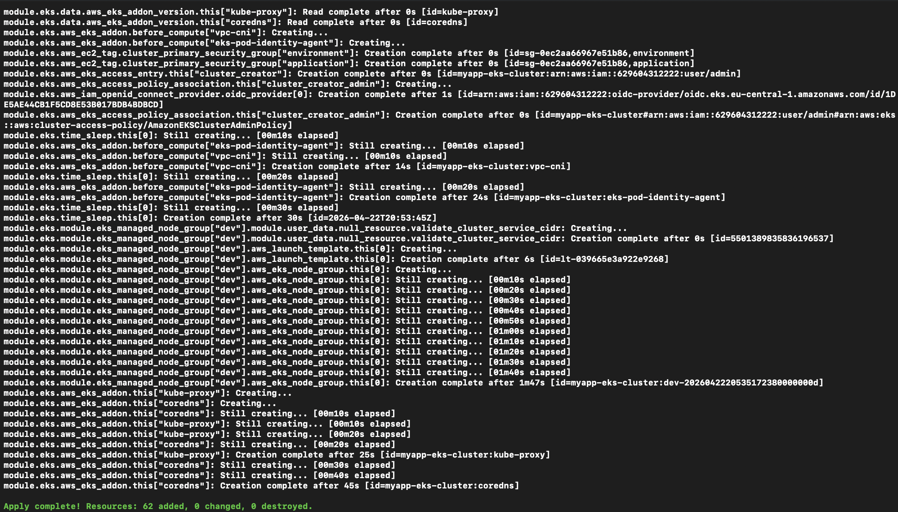

After apply, verify the cluster:

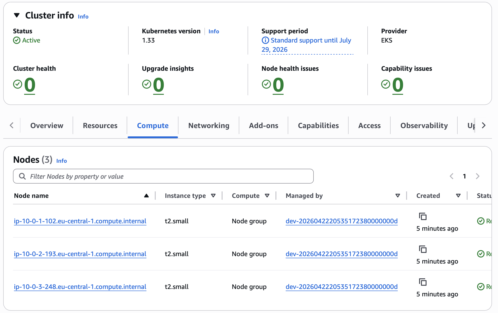

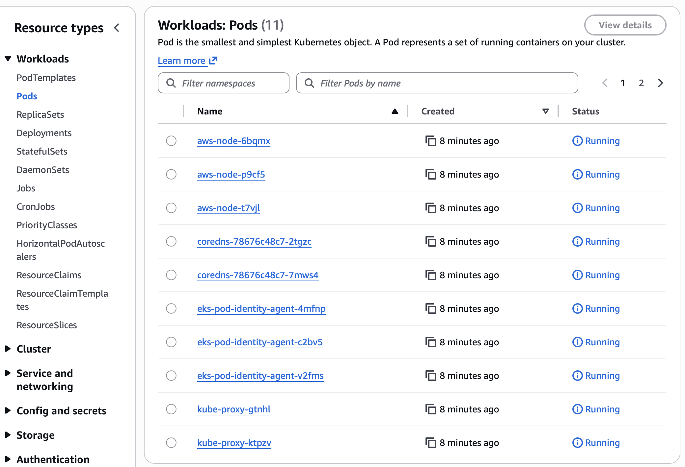

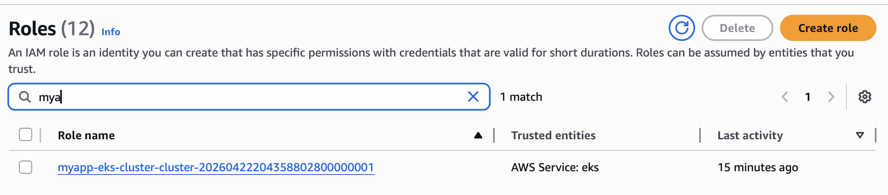

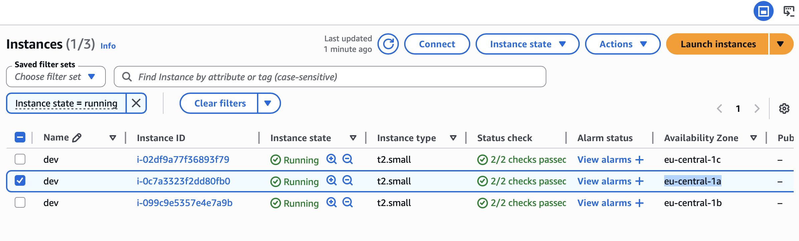

Private route table uses NAT Gateway to allow worker nodes in private subnets to reach the internet (e.g., pull images from Docker Hub):

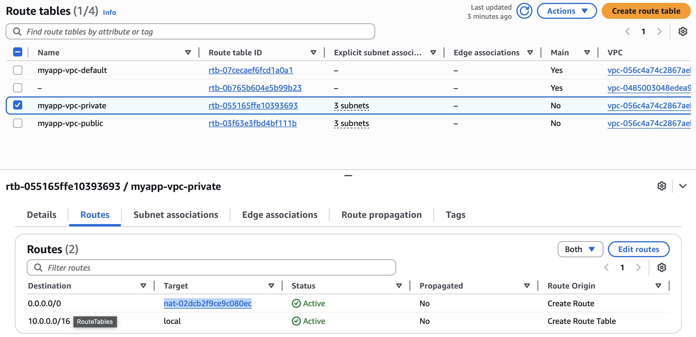

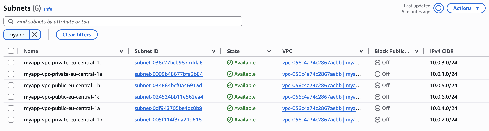

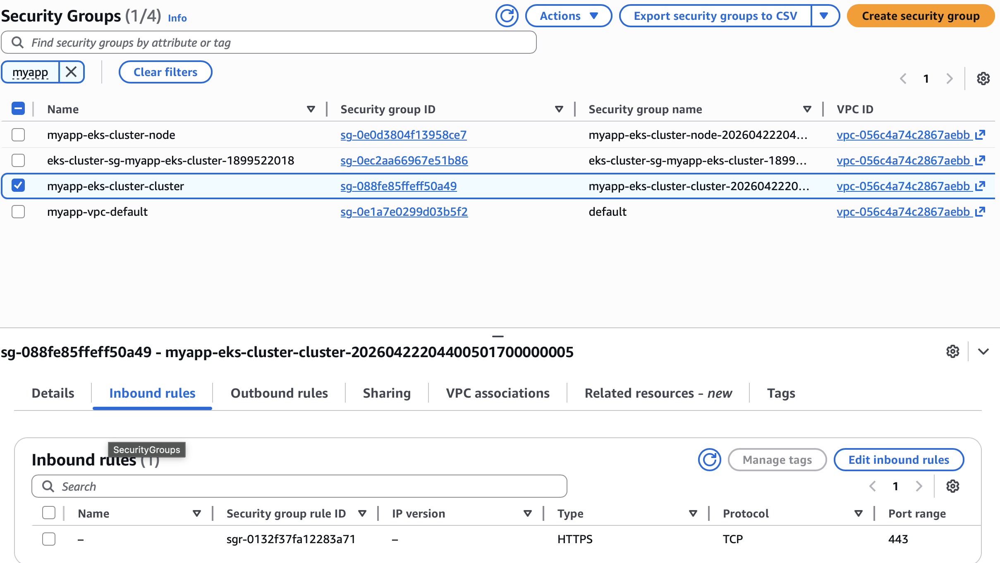

---

## Deploy nginx App into the Cluster

**1. Configure kubectl to talk to your cluster:**

```sh
aws eks update-kubeconfig --name myapp-eks-cluster --region eu-central-1
```

**2. Verify nodes are ready:**

```sh
kubectl get nodes
```

**3. Deploy the nginx application:**

```sh
kubectl apply -f nginx.yaml
```

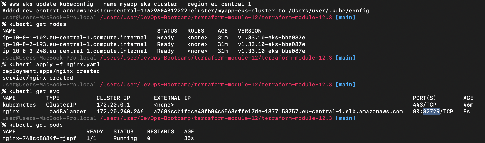

**4. Get the Load Balancer DNS name:**

Navigate to **EC2 → Load Balancers** in the AWS Console and copy the DNS name.

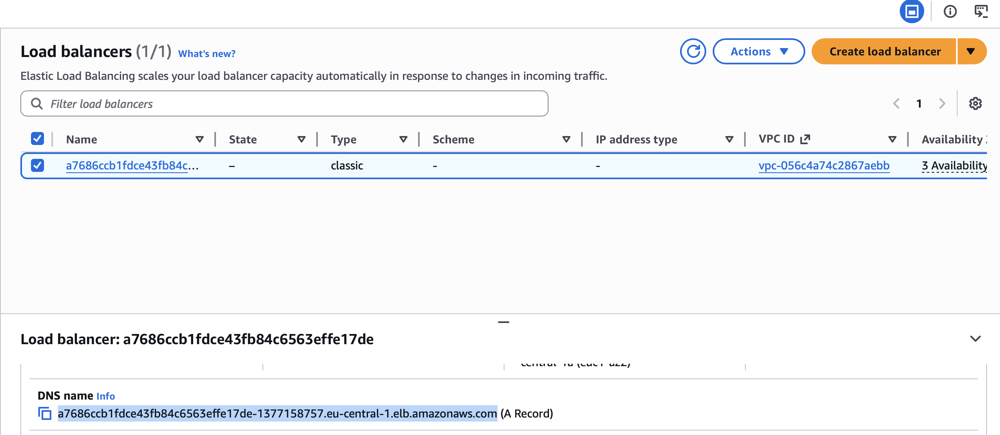

**5. Open the app in your browser:**

Paste the DNS name into your browser — nginx should respond.

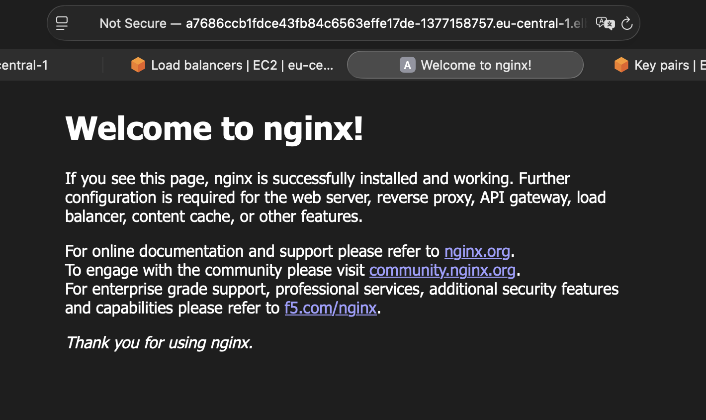

---

## Destroy All Components

```sh
terraform destroy --auto-approve
```

Verify everything is removed:

```sh
terraform state list
```

> If the state list is empty, all resources have been successfully destroyed.
